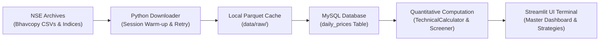

# ApexGrowth: Quantitative NSE Stock Screener & Systematic Market Terminal

[](https://www.python.org/downloads/)
[](https://streamlit.io/)
[](https://www.mysql.com/)
[](https://www.sqlalchemy.org/)
[](LICENSE)

An institutional-grade quantitative data platform and analytical terminal engineered for equities traded on the **National Stock Exchange of India (NSE)**. The platform orchestrates automated ingestion of official daily Bhavcopy archives, caches high-throughput time-series records via Apache Parquet, persists clean relational schema inside MySQL with idempotent upserts, computes cross-sectional momentum and trend indicators, and surfaces actionable trading strategies via a high-performance, dark-mode **Streamlit** financial terminal.

---

## 🎯 Executive Summary & Business Problem

Institutional asset managers and active quantitative analysts in emerging markets encounter persistent structural friction:
1. **Survivorship & Penny-Stock Noise:** Unfiltered market datasets encompass thousands of illiquid, micro-cap, or delisted scrips that distort momentum models and generate execution slippage.
2. **Data Ingestion Fragility & Exchange Rate-Limiting:** Exchange archives (such as NSE Bhavcopies) frequently change column schemas, throttle automated scraping, and exhibit intermittent availability without structured retry protocols.
3. **Database Concurrency & Duplication Risks:** Daily historical data ingestion without idempotent upsert semantics leads to corrupted time-series integrity or slow, manual table maintenance.
4. **Actionable Alpha Discovery:** Analysts require systematic, mathematically sound screening strategies that combine multi-timeframe moving averages, liquidity volume surges, and non-overheated structural momentum.

**ApexGrowth** resolves this by automating an institutional end-to-end data pipeline:
- **Restricts Universe** to official constituents of **NIFTY 100**, **NIFTY Midcap 150**, and **NIFTY Smallcap 250** (~500 institutional-grade stocks).
- **Hardened Ingestion Engine** with user-agent rotation, cookie warm-up, exponential backoff, and localized Parquet caching.
- **Relational Storage** utilizing MySQL 8.0 and SQLAlchemy 2.0 with atomic `ON DUPLICATE KEY UPDATE` batch upserts.
- **Cross-Sectional Vectorized Math** computing 35+ metrics including moving averages, multi-horizon lookback returns (1D, 1M, 3M, 6M, 12M), historical shifted prices, and rolling highs.
- **Multi-Page Terminal Dashboard** presenting interactive cross-sectional screening, dynamic column selection, and custom strategy filters.

---

## 🏗️ End-to-End Architectural Pipeline

The system is architected as an automated, multi-tiered quantitative engine:



### Architectural Highlights
- **Resilient Downloader (`src/ingestion/`):** Employs HTTP session initialization against the NSE portal, automated header rotation, exponential backoff retries, and schema normalization across varying historical exchange formats.
- **High-Speed Cache Layer (`data/raw/`):** Daily files are parsed into Apache Parquet format. Subsequent historical queries bypass the network entirely, rendering re-runs instantaneous.
- **Idempotent MySQL Loader (`src/etl/pipeline.py`):** Batch loads records in chunks of 1,000 using SQLAlchemy's MySQL dialect `INSERT ... ON DUPLICATE KEY UPDATE` to guarantee strict deduplication on composite key `(symbol, date)`.
- **Vectorized Indicator Engine (`src/computation/indicators.py`):** Leverages NumPy and Pandas vectorized operations grouped strictly per stock symbol to prevent cross-stock data leakage.
- **Asynchronous UI Ingestion Trigger (`ui/`):** Streamlit state management (`st.session_state`) triggers incremental market data fetches in the background without UI blocking.

---

## 💻 Technology Stack

| Layer | Technologies | Rationale & Responsibilities |
| :--- | :--- | :--- |
| **Language & Environment** | Python 3.11+, Virtualenv | Core language runtime, type annotations, and virtual environment isolation. |
| **Data Engineering & Math** | Pandas, NumPy, PyArrow | Vectorized computations, rolling windows, multi-period percentage returns, and Parquet caching. |
| **Relational Database** | MySQL 8.0, PyMySQL | High-integrity ACID storage for OHLCV time-series and market-cap tier categorizations. |
| **ORM & Database Layer** | SQLAlchemy 2.0 | Declarative ORM models, connection pooling (pre-ping, recycling), and MySQL dialect upserts. |
| **Web UI & Analytics** | Streamlit, Plotly | Low-latency financial terminal UI with dark-mode styling, dynamic multi-select, and KPIs. |
| **Networking & Ingestion** | Requests, Session Pooling | HTTP session warm-up, custom browser headers, and exponential retry handlers. |
| **Testing & Quality** | Pytest, Python Logging | Unit test coverage for financial math, edge-case validation, and 5MB rotating file logs. |

---

## 🗄️ Database Modeling & Schema Migration

### Entity Relationship & Table Design

The core relational table `daily_prices` stores daily OHLCV records mapped to their respective market-cap index:

```sql
CREATE TABLE daily_prices (
    id BIGINT AUTO_INCREMENT PRIMARY KEY,
    symbol VARCHAR(20) NOT NULL,
    date DATE NOT NULL,
    open NUMERIC(10, 2),
    high NUMERIC(10, 2),
    low NUMERIC(10, 2),
    close NUMERIC(10, 2),
    volume BIGINT,
    index_name VARCHAR(50),
    CONSTRAINT uq_symbol_date UNIQUE (symbol, date),
    INDEX ix_daily_prices_symbol (symbol),
    INDEX ix_daily_prices_date (date),
    INDEX ix_daily_prices_index_name (index_name)
) ENGINE=InnoDB DEFAULT CHARSET=utf8mb4;
```

### Schema Migration: Adding `index_name`
Because SQLAlchemy's `Base.metadata.create_all()` will not alter existing database tables, execute the provided migration script or raw SQL statement below to update an existing database:

#### Raw SQL Migration (`scripts/migration.sql`)
```sql
ALTER TABLE daily_prices ADD COLUMN index_name VARCHAR(50) NULL;
CREATE INDEX ix_daily_prices_index_name ON daily_prices (index_name);
```

#### Automated Python Migration
Alternatively, run the automated migration script which inspects `information_schema` and safely executes the modification:
```bash
python scripts/migrate_add_index_name.py
```

---

## 📐 Quantitative Logic & Screening Strategies

ApexGrowth evaluates two proprietary systematic momentum strategies designed for mid-to-large cap equities:

### Strategy 1: "Liquid 1.5x Vol"
Screens for equities undergoing institutional volume accumulation while maintaining an unbroken multi-timeframe bullish trend.

$$\begin{aligned}
\text{Universe} &\in \{\text{NIFTY 100}, \text{NIFTY Midcap 150}, \text{NIFTY Smallcap 250}\} \\
\text{MA Trend Stack} &: \text{EMA}_{20}(\text{Close}) > \text{SMA}_{50}(\text{Close}) > \text{SMA}_{200}(\text{Close}) \\
\text{Price Dominance} &: \text{Close} > \text{SMA}_{50}(\text{Close}) \quad \text{and} \quad \text{Close} > \text{SMA}_{200}(\text{Close}) \\
\text{52W High Proximity} &: \text{Close} \ge 0.85 \times \text{High}_{252d,\text{prev}} \\
\text{Liquidity Expansion} &: \text{Volume} > 1.5 \times \text{SMA}_{20}(\text{Volume}) \quad \text{and} \quad \text{SMA}_{20}(\text{Volume}) > 250{,}000
\end{aligned}$$

---

### Strategy 2: "Liquid 1.5x Vol Momentum"
Builds upon Strategy 1 by demanding strong intermediate price velocity while filtering out climax runs and over-extended parabolic blow-offs.

$$\begin{aligned}
\text{Prerequisite} &: \text{Meets 100\% of Strategy 1 criteria} \\
\text{Anti-Overheating} &: \text{Return}_{60d} \le 40\% \\
\text{Long-term Base Spread} &: \frac{\text{Close} - \text{Close}_{252d}}{\text{Close}_{180d}} \times 100 \le 300\% \\
\text{Inter-Horizon Ceiling} &: \frac{\text{Close} - \text{Close}_{180d}}{\text{Close}_{252d}} \times 100 \le 300\% \\
\text{Inter-Horizon Floor} &: \frac{\text{Close} - \text{Close}_{180d}}{\text{Close}_{252d}} \times 100 \ge 50\% \\
\text{Medium-term Velocity} &: \text{Return}_{120d} \ge 30\%
\end{aligned}$$

---

## 🚀 Setup & Execution Guide (macOS / VS Code)

Follow these reproducible steps to run the complete environment locally on macOS:

### 1. Clone Repository & Setup Virtual Environment
```bash
# Clone the repository
git clone https://github.com/YashSharma333/nse-screener.git
cd nse-screener

# Create Python virtual environment
python3 -m venv .venv

# Activate virtual environment
source .venv/bin/activate

# Upgrade pip and install all production dependencies
pip install --upgrade pip
pip install -r requirements.txt
```

### 2. Configure Environment Variables
Copy `.env.example` to `.env` and configure your local MySQL credentials:
```bash
cp .env.example .env
```
Edit `.env` in VS Code or via terminal:
```env
MYSQL_HOST=localhost
MYSQL_PORT=3306
MYSQL_USER=root
MYSQL_PASSWORD=your_mysql_password
MYSQL_DB=nse_screener
```

### 3. Initialize MySQL Database & Run Migrations
Ensure MySQL server is running (e.g., via `brew services start mysql` or Docker). Initialize tables and run migrations:
```bash
python scripts/migrate_add_index_name.py
```

### 4. Run Massive Historical Ingestion (CLI)
Execute the CLI ETL pipeline to download 3 years (~1,100 days) of Bhavcopy records:
```bash
# Standard 3-year historical ingestion for NIFTY 100, Midcap 150, Smallcap 250
python run_pipeline.py

# Optional parameters for custom historical window or delay:
python run_pipeline.py --days-back 365 --delay 0.5 --batch-size 1000
```

### 5. Launch the Streamlit Financial Terminal
Launch the multi-page terminal dashboard:
```bash
streamlit run ui/Dashboard.py
```
Open [http://localhost:8501](http://localhost:8501) in your browser.

> [!NOTE]
> **Zero-Friction Fallback:** If local MySQL is not running or the database is unpopulated, the application automatically activates **Demonstration Mode**, synthesizing a representative NIFTY universe dataset so all terminal screens, formulas, and strategies remain fully testable and reviewable.

### 6. Run Test Suite
Validate calculations, screening filters, and database models across 25+ unit tests:
```bash
pytest
```

---

## 📂 Repository Structure

```
nse-screener/
├── config/
│   ├── logger.py                 # Secondary logging helpers
│   └── settings.py               # Centralized rotating file & stdout logging config
├── data/
│   └── raw/                      # Local Parquet cache for historical Bhavcopies
├── logs/
│   └── screener.log              # 5MB rotating application logs
├── scripts/
│   ├── migration.sql             # Raw SQL migration script for index_name
│   ├── migrate_add_index_name.py # Safe Python database migration script
│   └── update_github_meta.sh     # Script to configure GitHub repo metadata & topics
├── src/
│   ├── computation/
│   │   ├── indicators.py         # TechnicalCalculator (MAs, RSIs, Lookbacks, Shifts)
│   │   └── screener.py           # Compatibility wrapper for StockScreener
│   ├── db/
│   │   ├── data_service.py       # Data querying, demo generation & indicator aggregation
│   │   ├── models.py             # SQLAlchemy 2.0 ORM models (DailyPrice, TechnicalIndicator)
│   │   └── session.py            # Engine connection pooling & transaction context managers
│   ├── etl/
│   │   └── pipeline.py           # BhavcopyETL: Date resolution, download, batch upsert
│   ├── ingestion/
│   │   ├── downloader.py         # Resilient NSE Bhavcopy HTTP downloader
│   │   └── index_constituents.py # NSEIndexConstituents (NIFTY 100, Midcap 150, Smallcap 250)
│   └── screener.py               # StockScreener: Liquid 1.5x Vol & Momentum Strategies
├── tests/
│   ├── test_indicators.py        # Unit tests for technical indicator math
│   ├── test_pipeline.py          # Unit tests for constituent mapping & DB models
│   └── test_screener.py          # Unit tests for quantitative screening strategies
├── ui/
│   ├── Dashboard.py              # Master market screener dashboard & application entrypoint
│   ├── components/
│   │   ├── stock_inspector.py    # Interactive candlestick, MA stack, volume & RSI inspector
│   │   └── terminal_styles.py    # Dark-mode Bloomberg terminal CSS & header telemetry
│   └── pages/
│       ├── 2_swing_volume.py     # Filtered view for Strategy: Swing + Volume
│       └── 3_swing_momentum.py   # Filtered view for Strategy: Swing With Momentum
├── pytest.ini                    # Pytest configuration root
├── requirements.txt              # Production dependency specifications
├── run_pipeline.py               # CLI runner for massive historical Bhavcopy ETL
└── README.md                     # Capstone documentation & engineering showcase
```

---

## 🛠️ GitHub Repository Metadata Automation

To update the GitHub repository description and topics to match portfolio requirements, execute the included script:

```bash
chmod +x scripts/update_github_meta.sh
./scripts/update_github_meta.sh
```

This sets:
- **Description:** *"ApexGrowth: A Python and MySQL-backed quantitative NSE stock screener and ETL pipeline."*
- **Topics:** `python`, `streamlit`, `data-analytics`, `sql`, `quantitative-analysis`

---

## 👤 Author & Portfolio Context
- **Developer:** Yash Sharma
- **Domain:** Quantitative Development, Data Analytics & Financial Engineering
- **Focus Areas:** Scalable ETL Pipelines, Relational Modeling, Quantitative Momentum Strategies