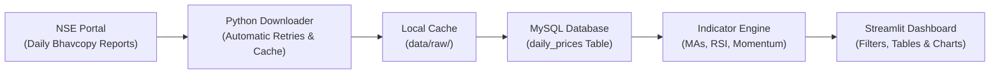

# NSE Screener: Stock Screener & Trading Terminal for NSE India

[](https://www.python.org/downloads/)
[](https://streamlit.io/)
[](https://www.mysql.com/)
[](https://www.sqlalchemy.org/)
[](LICENSE)

A clean, fast, and automated stock screener and market terminal for stocks on the **National Stock Exchange of India (NSE)**.

The system automatically downloads official daily NSE Bhavcopy market reports, saves clean price history into a MySQL database, calculates key technical indicators like moving averages and momentum metrics, and displays filtered stock setups on a modern, dark-themed **Streamlit** web terminal.

---

## 🎯 What Problem Does This Solve?

When scanning and analyzing Indian equities, traders and investors frequently run into several practical challenges:

1. **Penny Stock Clutter & Low Liquidity:** There are over 2,000 listed stocks on the NSE. Scanning all of them includes illiquid, micro-cap stocks with unpredictable swings and execution risks.
2. **Fragile NSE Downloads:** Downloading daily reports directly from the exchange often breaks because of network timeouts, rate limits, or missing trading holiday data.
3. **Messy & Duplicate Data:** Daily price files must be loaded cleanly without creating duplicate records or slowing down database queries.
4. **Time-Consuming Manual Scanning:** Finding stocks that have strong uptrends, unusual volume surges, and healthy price momentum usually requires manually checking hundreds of charts each day.

**NSE Screener** automates the entire process:
- **Filters the Top 500 Quality Stocks:** Strictly tracks constituents of **NIFTY 100**, **NIFTY Midcap 150**, and **NIFTY Smallcap 250**.
- **Smart & Reliable Downloader:** Downloads daily Bhavcopies with browser session handling, retries, and local file caching so you never download the same day twice.
- **Clean Database Storage:** Stores OHLCV prices in MySQL 8.0 with automatic deduplication using composite keys `(symbol, date)`.
- **Calculates 35+ Technical Indicators:** Computes moving averages (SMA 20/50/200, EMA 20), RSI, 52-week rolling highs, and multi-period percentage returns (1D, 1M, 3M, 6M, 12M) per stock.
- **Interactive Web Terminal:** Displays ready-to-trade swing setups, customizable tables, and multi-panel candlestick charts.

---

## 🏗️ How It Works (Project Workflow)

The project follows a simple, robust pipeline:



### Key Workflow Highlights
- **Smart Downloader (`src/ingestion/`):** Connects to the NSE portal using browser-like headers, handles session cookies, and retries automatically on network errors.
- **Local File Cache (`data/raw/`):** Converts raw daily files to Apache Parquet format. If you run the pipeline again, it reads from cache instead of downloading again.
- **Safe Database Loader (`src/etl/pipeline.py`):** Loads rows in batches of 1,000 using MySQL's `INSERT ... ON DUPLICATE KEY UPDATE`. It safely skips or updates already-stored dates.
- **Indicator Calculations (`src/computation/indicators.py`):** Computes indicators grouped strictly by stock symbol to avoid mixing data across different companies.
- **Interactive UI (`ui/`):** Built with Streamlit, featuring a dark Bloomberg-style theme, responsive navigation cards, and interactive Plotly candlestick charts.

---

## 💻 Tech Stack

| Component | Technologies Used | What It Does |
| :--- | :--- | :--- |
| **Language** | Python 3.11+ | Main programming language for scripts, calculations, and the UI. |
| **Data Processing** | Pandas, NumPy, PyArrow | Fast data cleaning, rolling window calculations, and Parquet caching. |
| **Database** | MySQL 8.0, PyMySQL | Stores daily stock prices, trading volumes, and index categories. |
| **Database Layer** | SQLAlchemy 2.0 | Manages database connections, tables, and upsert operations. |
| **Web Dashboard** | Streamlit, Plotly | Interactive terminal with dark mode, custom filters, and candlestick charts. |
| **Networking** | Requests | Downloads market reports with session cookies and retry handlers. |
| **Testing** | Pytest | Automated test suite verifying data logic, indicators, and UI pages. |

---

## 🗄️ Database Design & Setup

### Table Structure (`daily_prices`)

The primary table stores daily OHLCV (Open, High, Low, Close, Volume) data for each stock:

```sql
CREATE TABLE daily_prices (
    id BIGINT AUTO_INCREMENT PRIMARY KEY,
    symbol VARCHAR(20) NOT NULL,
    date DATE NOT NULL,
    open NUMERIC(10, 2),
    high NUMERIC(10, 2),
    low NUMERIC(10, 2),
    close NUMERIC(10, 2),
    volume BIGINT,
    index_name VARCHAR(50),
    CONSTRAINT uq_symbol_date UNIQUE (symbol, date),
    INDEX ix_daily_prices_symbol (symbol),
    INDEX ix_daily_prices_date (date),
    INDEX ix_daily_prices_index_name (index_name)
) ENGINE=InnoDB DEFAULT CHARSET=utf8mb4;
```

### Adding `index_name` to Existing Databases

If you have an existing database without the `index_name` column, run the migration script:

```bash
# Automated Python migration
python scripts/migrate_add_index_name.py
```

Or apply raw SQL directly:
```sql
ALTER TABLE daily_prices ADD COLUMN index_name VARCHAR(50) NULL;
CREATE INDEX ix_daily_prices_index_name ON daily_prices (index_name);
```

---

## 📐 Trading Strategies & Screening Rules

The screener includes two pre-built swing trading strategies:

### Strategy 1: "Swing + Volume"
Finds stocks in a strong uptrend that are experiencing a fresh surge in trading volume near their 52-week highs.

- **Stock Universe:** Must belong to NIFTY 100, NIFTY Midcap 150, or NIFTY Smallcap 250.
- **Uptrend Alignment:** 20 EMA > 50 SMA > 200 SMA.
- **Key Price Levels:** Current price is above both the 50 SMA and 200 SMA.
- **Near 52-Week High:** Price is within 15% of its previous 52-week high.
- **Volume Expansion:** Today's volume is at least 1.5 times the 20-day average volume, and the 20-day average volume is at least 250,000 shares.

---

### Strategy 2: "Swing With Momentum"
Builds on Strategy 1 by demanding steady, intermediate price gain while filtering out stocks that have already run up too fast (overheated).

- **Prerequisite:** Must meet all conditions of Strategy 1.
- **Not Overextended:** 60-day return is 40% or less (avoids buying at the tail end of explosive spikes).
- **Steady Long-Term Gain:** Positive multi-month gain between 180 and 252 trading days.
- **Medium-Term Strength:** 120-day return is at least 30%.

---

## 🚀 Quickstart Guide (macOS / VS Code)

Follow these steps to get the project up and running locally:

### 1. Clone the Project & Create Virtual Environment
```bash
# Clone the repository
git clone https://github.com/YashSharma333/nse-screener.git
cd nse-screener

# Create and activate virtual environment
python3 -m venv .venv
source .venv/bin/activate

# Install required packages
pip install --upgrade pip
pip install -r requirements.txt
```

### 2. Set Up Environment Variables
Copy the sample environment file:
```bash
cp .env.example .env
```
Open `.env` and set your local MySQL connection settings:
```env
MYSQL_HOST=localhost
MYSQL_PORT=3306
MYSQL_USER=root
MYSQL_PASSWORD=your_password
MYSQL_DB=nse_screener
```

### 3. Initialize the Database
Ensure your MySQL server is running, then run the database setup script:
```bash
.venv/bin/python scripts/migrate_add_index_name.py
```

### 4. Download Market Data
Run the data pipeline to fetch historical market data:
```bash
# Fetch latest days incrementally (fastest)
.venv/bin/python run_pipeline.py --incremental

# Download full historical data (e.g., past 3 years)
.venv/bin/python run_pipeline.py

# Download past 365 days
.venv/bin/python run_pipeline.py --days-back 365
```

### 5. Launch the Dashboard
Start the web dashboard:
```bash
.venv/bin/streamlit run ui/Dashboard.py
```
Open [http://localhost:8501](http://localhost:8501) in your web browser.

> [!NOTE]
> **Built-in Demonstration Mode:** If MySQL is not running or hasn't been set up yet, the dashboard automatically starts in **Demonstration Mode**. It generates sample NIFTY stocks so you can immediately explore the tables, charts, and strategies without any setup hassle.
> You can also click **"🔄 Update Latest Market Data"** on the dashboard anytime to sync the newest days right from the browser.

### 6. Run the Test Suite
Run the 53 unit and UI integration tests:
```bash
.venv/bin/pytest tests/ -v
```

---

## 📂 Project Structure

```
nse-screener/
├── config/
│   └── settings.py               # Central logging configuration
├── data/
│   └── raw/bhavcopy_cache/       # Local Parquet cache for downloaded market files
├── logs/
│   └── screener.log              # Application logs
├── scripts/
│   ├── migration.sql             # SQL script to add index_name column
│   ├── migrate_add_index_name.py # Python script for database migration
│   └── update_github_meta.sh     # Script to update GitHub repository description
├── src/
│   ├── computation/
│   │   ├── indicators.py         # Moving averages, RSI, and return calculations
│   │   └── screener.py           # Stock screener strategy rules
│   ├── db/
│   │   ├── data_service.py       # Database queries and demo data generation
│   │   ├── models.py             # SQLAlchemy database tables
│   │   └── session.py            # MySQL database connection pool
│   ├── etl/
│   │   └── pipeline.py           # Ingestion pipeline: downloads, formats, and stores data
│   ├── ingestion/
│   │   ├── downloader.py         # NSE Bhavcopy file downloader with retries
│   │   └── index_constituents.py # NIFTY index stock lists (100, Midcap 150, Smallcap 250)
│   └── screener.py               # Screener class wrapper
├── tests/
│   ├── test_etl.py               # Tests for data downloading and database loading
│   ├── test_indicators.py        # Tests for indicator math and calculations
│   ├── test_pipeline.py          # Tests for data models and mappings
│   ├── test_screener.py          # Tests for screening strategy logic
│   └── test_ui_pages.py          # Tests for Streamlit web pages
├── ui/
│   ├── Dashboard.py              # Main screener dashboard page
│   ├── components/
│   │   ├── stock_inspector.py    # Candlestick chart and technical indicators view
│   │   └── terminal_styles.py    # Dark terminal theme and sidebar navigation styling
│   └── pages/
│       ├── 2_swing_volume.py     # Strategy page: Swing + Volume
│       └── 3_swing_momentum.py   # Strategy page: Swing With Momentum
├── PROJECT_GUIDE.md              # Detailed architecture and code guide
├── pytest.ini                    # Test runner configuration
├── requirements.txt              # Project Python dependencies
├── run_pipeline.py               # CLI tool to run the data pipeline
└── README.md                     # Project documentation
```

---

## 👤 Author
- **Developer:** Yash Sharma
- **Focus:** Data Engineering, Python Development & Stock Market Analytics